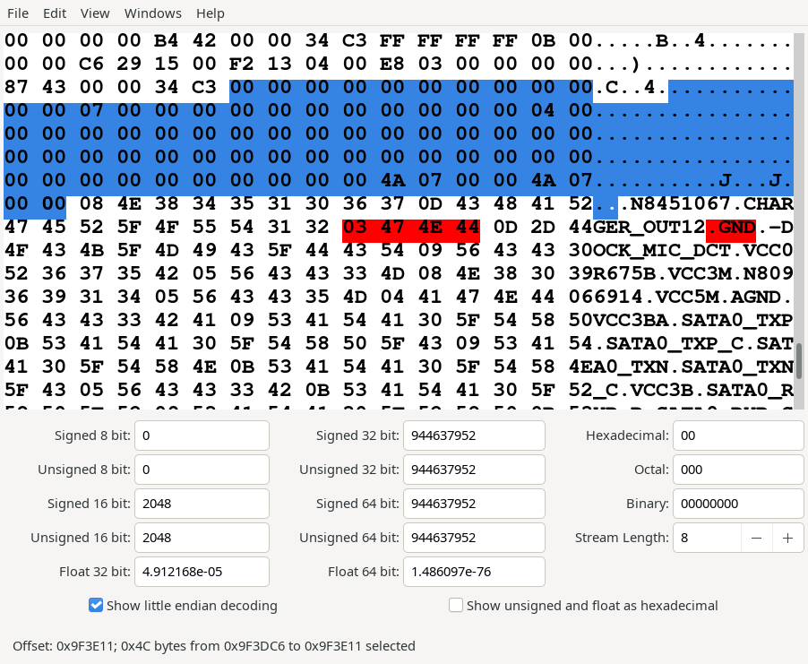
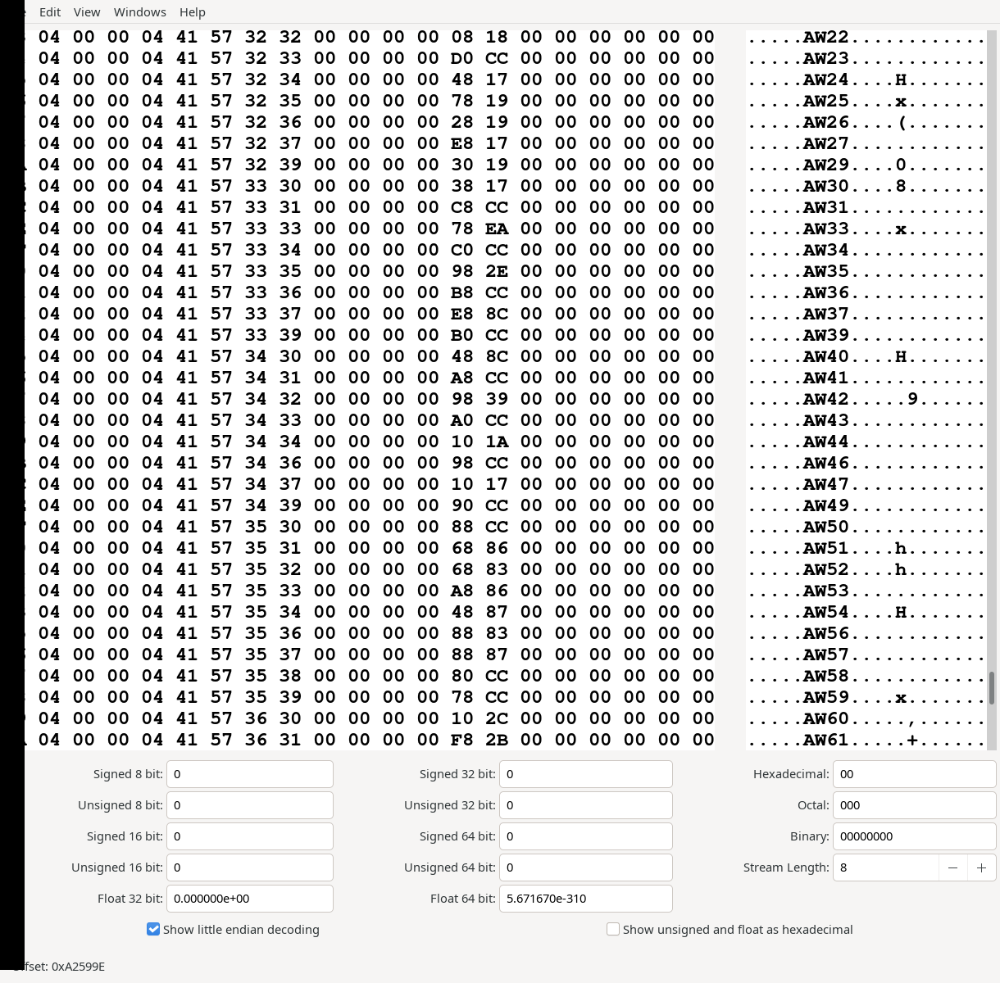

# teboviewformat
An attempt to reverse engineer enough of the Teboview (tvw) file format to allow Boardview generation

## NO FURTHER UPDATES
After 2 years the format has been reverse engineered however due to the extensive work required and personal investment, I'll be keeping this one closed until such time that I've recouped my time investment ( perhaps $10~15k USD worth ). You however can now obtain FlexBV Free, Demo or licenced versions at https://pldaniels.com/flexbv5 which provide boardviewer support for this format.

## Intro
The teboview file (.tvw) is an EDA type package which includes all details for the production and testing of PCBs.  The purpose of this decoding attempt is so that we can write an import/reading module in order to view a simplified version in boardview packages such as OpenBoardview.

The bulk of the information that is required should appear after the end of the layer data. From what is currently understood, the network name list is the preliminary block of data of interest ( essentially a direct sequence of tvw-string types with a prefixed count size ).

## Preliminary Goal
A minimal working implementation will decode 
* part names/position
* network names/position
* pin names/position and associated with the part and network

## Where we are now
Currently we can decode manually;
* part name/position including package type and associated pin positions
* network names ( and possibly their direct index ID )
* pin positions and their _indirect_ network ID

## What we need still
* Pin ID <=:=> Network ID association map

Network names are easy enough to generate an array from

But tying them together with the 3-bit shifted pin ID (+8 for each pin) is something we need to work out still

